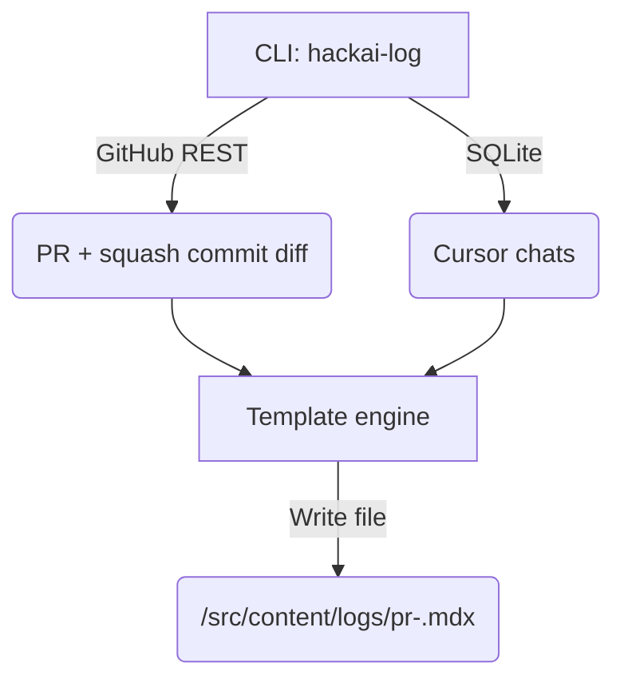

## 0 High-level flow



---

## 1 GitHub data

| Step | What you'll do | Tips |
|------|----------------|------|
| 1.1 | **Create a PAT** with `repo` scope → store locally as `GITHUB_TOKEN`. | Settings ➜ Developer settings ➜ Personal access tokens (classic). |
| 1.2 | In the CLI, call `https://api.github.com/repos/<owner>/<repo>/pulls/<n>` to grab: title, body, labels, merge commit SHA, dates. | Use `octokit/rest` (Node) or `PyGithub` (Python) — whichever language you're faster in. |
| 1.3 | Fetch the **squash commit** via `GET /repos/<owner>/<repo>/commits/<sha>`<br/>then `GET /repos/<owner>/<repo>/commits/<sha>/diff` (or `?accept=application/vnd.github.v3.diff`). | Pipe diff lines through a "window" function that keeps ±20 around each hunk. |
| 1.4 | Collect PR labels → map to `tags`. | e.g. `feature`, `bugfix`, `refactor`. |

---

## 2 Cursor chat extraction

| Step | What you'll do | Notes |
|------|----------------|-------|
| 2.1 | Accept path(s) to `state.vscdb` as CLI arg or env var. | For now: `./cursor-logs/state.vscdb` once added to repo (git-ignored). |
| 2.2 | Run a **SQLite query**:<br/>```sql<br/>SELECT created, content FROM items WHERE type='conversation' ORDER BY created;<br/>``` | Cursor stores each message JSON in `content`. |
| 2.3 | Filter rows whose `content` mention the PR branch name, number, or commit SHA (simple regex). | Keeps unrelated chats out. |
| 2.4 | Emit each prompt/response pair as: <br/>```mdx<br/>#### 💬 Prompt<br/>(markdown)<br/><br/>##### 🤖 LLM<br/>(markdown)<br/>``` | If page gets huge, wrap each pair in `<details>`. |

---

## 3 MDX template

```mdx
---
title: "PR #{pr_number} – {pr_title}"
pr_number: {pr_number}
date: "{merged_at}"
tags: [{label_list}]
related_guide: "{guide_slug}"
mvp_success: {bool}
non_goals: {bool}
---

import { DiffBlock } from '../../components/DiffBlock' // optional

## Summary
{pr_body_or_custom_summary}

## Diff Highlights
<DiffBlock>
```diff
{cropped_diff /* ≤ 20 lines per hunk */}
```
</DiffBlock>

[{commit_url}]({commit_url}) for full diff.

## LLM Transcript
{full_or_collapsed_chat_markdown}
```

*If you already syntax-highlight diffs via Prism/react-syntax-highlighter, you can drop the `<DiffBlock>` wrapper.*

---

## 4 Project Structure & Types

```typescript
scripts/
├── types/                    // TypeScript type definitions
│   ├── github.ts            // GitHub API related types
│   ├── sqlite.ts           // SQLite schema types
│   ├── mdx.ts             // MDX template types
│   └── config.ts          // Configuration types
├── utils/                    // Utility functions
│   ├── github.ts           // GitHub API interactions
│   ├── sqlite.ts          // SQLite operations
│   ├── template.ts        // MDX template rendering
│   └── config.ts         // Configuration management
├── hackai-log.ts            // Main CLI script
└── constants.ts             // Shared constants
```

```bash
pnpm add -D @octokit/rest commander yaml sqlite3 chalk zod dotenv
pnpm add -D @types/sqlite3 tsx
```

```ts
// scripts/types/github.ts
export interface PullRequestData {
  number: number;
  title: string;
  body: string;
  labels: Array<{ name: string }>;
  merge_commit_sha: string;
  merged_at: string;
}

// scripts/types/config.ts
export interface Config {
  github: {
    token: string;
    owner: string;
    repo: string;
  };
  sqlite: {
    dbPath: string;
  };
  output: {
    mdxPath: string;
  };
}

// scripts/hackai-log.ts
import { Octokit } from '@octokit/rest';
import fs from 'fs/promises';
import { parse } from 'yaml';
import sqlite3 from 'sqlite3';
import { open } from 'sqlite';
import { program } from 'commander';
import { z } from 'zod';
import { Config } from './types/config';
import { loadConfig } from './utils/config';
import { fetchPRData } from './utils/github';
import { harvestCursorChats } from './utils/sqlite';
import { renderTemplate } from './utils/template';

program
  .requiredOption('-p, --pr <number>', 'Pull-request number')
  .option('-c, --config <path>', 'Path to config file', './.env')
  .parse();

const { pr, config: configPath } = program.opts();

async function main() {
  // Load and validate configuration
  const config = await loadConfig(configPath);
  
  // Initialize GitHub client
  const gh = new Octokit({ auth: config.github.token });
  
  // Fetch PR data and diff
  const prData = await fetchPRData(gh, config, +pr);
  
  // Get relevant cursor chats
  const chat = await harvestCursorChats(config, prData);
  
  // Generate MDX
  const mdx = await renderTemplate({ prData, chat });
  
  // Write output
  const outputPath = `${config.output.mdxPath}/pr-${pr}.mdx`;
  await fs.writeFile(outputPath, mdx);
  
  console.log(`✨ Generated documentation at ${outputPath}`);
}

main().catch(console.error);
```

## 5 Configuration & Setup

1. **Create `.env` file**:
   ```env
   GITHUB_TOKEN=ghp_xxx
   GITHUB_OWNER=19bmiles
   GITHUB_REPO=llm-project-guide
   SQLITE_DB_PATH=./cursor-logs/state.vscdb
   MDX_OUTPUT_PATH=./src/content/logs
   ```

2. **Add script to `package.json`**:
   ```json
   {
     "scripts": {
       "log:pr": "tsx scripts/hackai-log.ts",
       "log:pr:watch": "tsx watch scripts/hackai-log.ts"
     }
   }
   ```

3. **Update `.gitignore`**:
   ```gitignore
   # cursor DB
   cursor-logs/
   
   # environment
   .env
   .env.*
   ```

4. **Run with**:
   ```bash
   pnpm log:pr -p 1  # For PR #1
   ```

The script will:
- Validate environment/config
- Check GitHub token permissions
- Create output directory if needed
- Show progress with chalk-styled console output

---

## 6 Integration into the site

1. **Sidebar**: Add a new `Logs` section that auto-glob-imports `/src/content/logs/*.mdx` and sorts by `date`.
2. **Route**: `/logs/[slug]` mirrors your existing guides dynamic route (reuse `MDXContent` component).
3. **Styling**: reuse your code block theme; optionally tint the diff background forest-green (`bg-[#143d14]/10`).

---

## 7 Future automation roadmap

| Phase | Upgrade | Effort |
|-------|---------|--------|
| CI-1  | GitHub Action that runs the script on every merge to `main`, commits MDX back into `docs-bot` branch, opens PR. | 1 h |
| CI-2  | Also export PDF with `md-to-pdf` and attach to PR artifacts. | 45 min |
| UX-3  | Collapsible `<details>` around each chat pair when rendered length > *n* chars. | 20 min |
| DX-4  | Interactive wizard to pick PR, preview MDX, approve. | 2 h |

---

## 8 WIP & edge-case handling

* **Squash vs. rebase**: script reads the *merged* commit SHA; you'll always get the final state.  
* **Large chats**: set `MAX_MARKDOWN_SIZE`; if exceeded, truncate with "(…truncated, see original ChatGPT link)".  
* **Diff cropping**: respect `MAX_HUNK_LINES=20`; if a hunk is bigger, show first/last 10.  
* **Missing PAT**: exit with friendly error and open GitHub PAT creation URL in browser.
