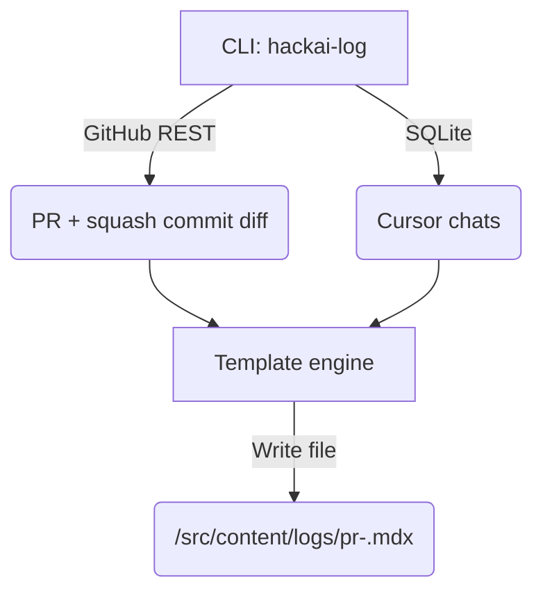

## 0 High-level flow



---

## 1 GitHub data

| Step | What you’ll do | Tips |
|------|----------------|------|
| 1.1 | **Create a PAT** with `repo` scope → store locally as `GITHUB_TOKEN`. | Settings ➜ Developer settings ➜ Personal access tokens (classic). |
| 1.2 | In the CLI, call `https://api.github.com/repos/<owner>/<repo>/pulls/<n>` to grab: title, body, labels, merge commit SHA, dates. | Use `octokit/rest` (Node) or `PyGithub` (Python) — whichever language you’re faster in. |
| 1.3 | Fetch the **squash commit** via `GET /repos/<owner>/<repo>/commits/<sha>`<br/>then `GET /repos/<owner>/<repo>/commits/<sha>/diff` (or `?accept=application/vnd.github.v3.diff`). | Pipe diff lines through a “window” function that keeps ±20 around each hunk. |
| 1.4 | Collect PR labels → map to `tags`. | e.g. `feature`, `bugfix`, `refactor`. |

---

## 2 Cursor chat extraction

| Step | What you’ll do | Notes |
|------|----------------|-------|
| 2.1 | Accept path(s) to `state.vscdb` as CLI arg or env var. | For now: `./cursor-logs/state.vscdb` once added to repo (git-ignored). |
| 2.2 | Run a **SQLite query**:<br/>```sql<br/>SELECT created, content FROM items WHERE type='conversation' ORDER BY created;<br/>``` | Cursor stores each message JSON in `content`. |
| 2.3 | Filter rows whose `content` mention the PR branch name, number, or commit SHA (simple regex). | Keeps unrelated chats out. |
| 2.4 | Emit each prompt/response pair as: <br/>```mdx<br/>#### 💬 Prompt<br/>(markdown)<br/><br/>##### 🤖 LLM<br/>(markdown)<br/>``` | If page gets huge, wrap each pair in `<details>`. |

---

## 3 MDX template

```mdx
---
title: "PR #{pr_number} – {pr_title}"
pr_number: {pr_number}
date: "{merged_at}"
tags: [{label_list}]
related_guide: "{guide_slug}"
mvp_success: {bool}
non_goals: {bool}
---

import { DiffBlock } from '../../components/DiffBlock' // optional

## Summary
{pr_body_or_custom_summary}

## Diff Highlights
<DiffBlock>
```diff
{cropped_diff /* ≤ 20 lines per hunk */}
```
</DiffBlock>

[{commit_url}]({commit_url}) for full diff.

## LLM Transcript
{full_or_collapsed_chat_markdown}
```

*If you already syntax-highlight diffs via Prism/react-syntax-highlighter, you can drop the `<DiffBlock>` wrapper.*

---

## 4 CLI skeleton (Node TypeScript, example)

```bash
pnpm add -D @octokit/rest commander yaml sqlite3 chalk
```

```ts
// scripts/hackai-log.ts
import { Octokit } from '@octokit/rest';
import fs from 'fs/promises';
import { parse } from 'yaml';
import sqlite3 from 'sqlite3';
import { open } from 'sqlite';
import { program } from 'commander';

program.requiredOption('-p, --pr <number>', 'Pull-request number');
program.parse();

const { pr } = program.opts();
const gh = new Octokit({ auth: process.env.GITHUB_TOKEN });

async function main() {
  const { data: prData } = await gh.pulls.get({ owner, repo, pull_number: +pr });
  const { data: commit } = await gh.repos.getCommit({
    owner, repo, ref: prData.merge_commit_sha
  });
  const diff = await gh.request(
    `GET /repos/${owner}/${repo}/commits/${commit.sha}`, {
      headers: { accept: 'application/vnd.github.v3.diff' }
    }
  );
  const cropped = cropDiff(diff.data); // implement ±20-line window
  const chat = await harvestCursorChats();
  const mdx = renderTemplate({ prData, cropped, chat });
  await fs.writeFile(`src/content/logs/pr-${pr}.mdx`, mdx);
}

main();
```

*Add `cropDiff`, `harvestCursorChats`, `renderTemplate` util modules to keep main clean.*

---

## 5 Repo wiring & dev UX

1. **Place script** in `package.json`:
   ```json
   "scripts": {
     "log:pr": "tsx scripts/hackai-log.ts"
   }
   ```
2. **Ignore** the raw `state.vscdb` with a `# cursor DB` line in `.gitignore` (if you prefer not to commit it).
3. **Run**:
   ```bash
   export GITHUB_TOKEN=ghp_xxx
   pnpm log:pr 42
   ```

A fresh `pr-42.mdx` appears under `/src/content/logs/`, hot-reloaded by next-MDX.

---

## 6 Integration into the site

1. **Sidebar**: Add a new `Logs` section that auto-glob-imports `/src/content/logs/*.mdx` and sorts by `date`.
2. **Route**: `/logs/[slug]` mirrors your existing guides dynamic route (reuse `MDXContent` component).
3. **Styling**: reuse your code block theme; optionally tint the diff background forest-green (`bg-[#143d14]/10`).

---

## 7 Future automation roadmap

| Phase | Upgrade | Effort |
|-------|---------|--------|
| CI-1  | GitHub Action that runs the script on every merge to `main`, commits MDX back into `docs-bot` branch, opens PR. | 1 h |
| CI-2  | Also export PDF with `md-to-pdf` and attach to PR artifacts. | 45 min |
| UX-3  | Collapsible `<details>` around each chat pair when rendered length > *n* chars. | 20 min |
| DX-4  | Interactive wizard to pick PR, preview MDX, approve. | 2 h |

---

## 8 WIP & edge-case handling

* **Squash vs. rebase**: script reads the *merged* commit SHA; you’ll always get the final state.  
* **Large chats**: set `MAX_MARKDOWN_SIZE`; if exceeded, truncate with “*(…truncated, see original ChatGPT link)*”.  
* **Diff cropping**: respect `MAX_HUNK_LINES=20`; if a hunk is bigger, show first/last 10.  
* **Missing PAT**: exit with friendly error and open GitHub PAT creation URL in browser.
